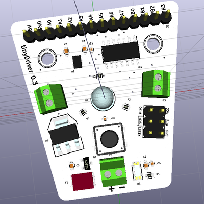
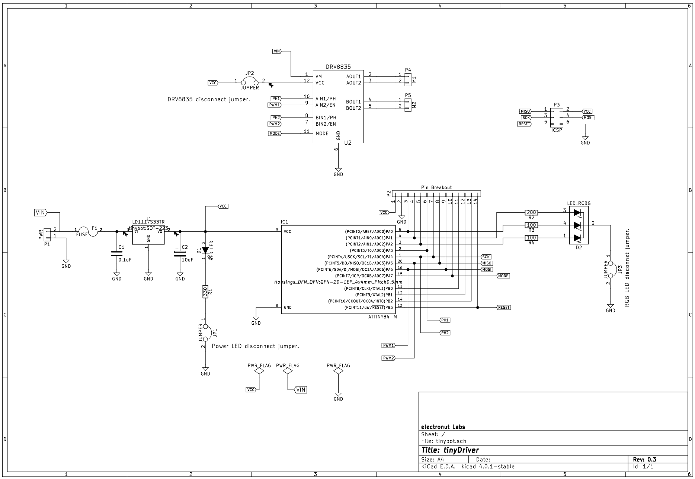

*Because you really don't need an Arduino for everything.*

<form action="https://www.crowdsupply.com/electronut/snapvcc">
  <input type="submit" value="Click to Purchase tinyDriver (USD 14.99)">
</form>

## Motivation

Arduino is a great platform to introduce someone to the world of 
microcontrollers. The user friendly hardware, easy IDE and extensive 
third party libraries make it a good choice for many projects.
But here's the thing. For someone who does not have an Electrical 
Engineering background (like myself), Arduino often gives a false 
sense of accomplishment. Blinking a few LEDs or interfacing with an 
ultrasonic sensor with code downloaded 
from the internet may make us feel like elite hackers, but the truth 
is that we have barely even *seen* the tip of the iceberg. 
It's perfectly fine to *start* your journey with an Arduino, but it's
good to be aware that there is a whole world of exciting electronics 
out there, beyond the confines of the Arduino garden.

Here are some reasons why you may want to explore Arduino 
alternatives:

- You want to reduce the cost of your project.
- You want to reduce the size of your project.
- You want to optimize your code size.
- You want to understand what the heck is going on!

In my view, the Atmel tinyAVR line is a great place to start your 
microcontroller journey. The chips vary in complexity across their line, 
and the simplest of them cost well under a US dollar. So how do you work 
with these chips? Well, the traditional way!

1. Get a tinyAVR.
2. Buy a cheap (USD 2) AVR programmer to upload the code.
3. Learn some C programming.
4. Read the tinyAVR datasheet.
5. Experiment!
6. Go back to #4. :-)

I have explored the tinyAVR family to some extent, and have written up 
some projects:

- [Getting Started with Atmel ATtiny10][1]
- [Talking to MMA7660 using I2C and ATtiny85][2]
- [Talking to Ultrasonic Distance Sensor HC-SR04 using an ATtiny84][3]
- [Serial Communications with the ATtiny84][4]

Since I find them to be very useful, I've been pondering the idea of
offering a workshop on these tiny microcontrollers.  I recently
decided to go ahead with this plan in the form of a workshop series
titled **Beyond Arduino**. I wanted some dedicated, easy to use
hardware to go with these sessions, and thus the idea of *tinyDriver*
was born.

## tinyDriver

*tinyDriver* is a breakout board for the Atmel ATtiny84 chip, which 
comes integrated with a motor driver chip and an RGB LED. The idea 
was to create a convenient platform that can be used to understand 
microcontrollers in depth, by studying the datasheet and making use of 
the various features of the chip such as timers, PWM, interrupts, ADC, 
and digital I/O. The free and cross-platform *avr-gcc* and *avrdude* 
toolchain combined with cheap USB based AVR programmers makes it very 
easy to develop projects for this board.

The idea is that you can use *tinyDriver* as a convenient platform 
to learn about tinyAVRs and prototype your projects.

*tinyDriver* is an Open Source hardware project. Here is the schematic:

*tinyDriver* has the following specifications:
 
- Atmel ATtiny84A microcontroller
- Integrated TI DRV8835 Dual-H-Bridge Motor Driver
- Diffused RGB LED
- Standard ICSP header for programming
- 500 mA PTC resettable fuse
- Reverse polarity protection
- 5 V regulator
- Power indicator LED
- Breaks out all pins of ATtiny84A
- Jumpers to disconnect LEDs and motor driver 
- Mounting holes

### Design Files

You can find the design files and sample code associated with *tinyDriver* here:

[https://github.com/electronut/tinyDriver][5]

## tinyDriver Documentation

Got a *tinyDriver*? Awesome. Begin your journey with the 
[getting started][6] guide.

### tinyDriver Applications

We are developing a number of exciting open source projects using
*tinyDriver*. Watch this space for details, but here are some of 
the ideas we are currently working on:

- Autonomous 2WD robot with ultrasonic sensor
- A laser display that syncs to audio input
- A mechanical iris controlled by a stepper motor
- A solenoid based drum machine

[1]: http://electronut.in/attiny10-hello/
[2]: http://electronut.in/attiny85-mma7660/
[3]: http://electronut.in/talking-to-ultrasonic-distance-sensor-hc-sr04-using-an-attiny84/
[4]: http://electronut.in/serial-communications-with-the-attiny84/
[5]: https://github.com/electronut/tinyDriver
[6]: http://electronut.in/tinyDriver/start